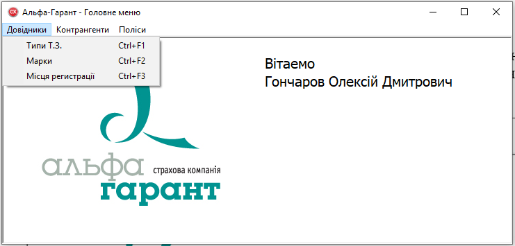
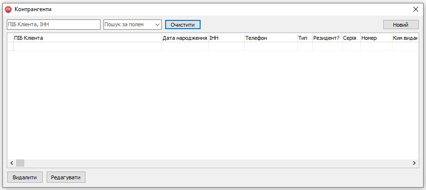
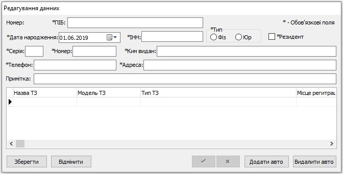
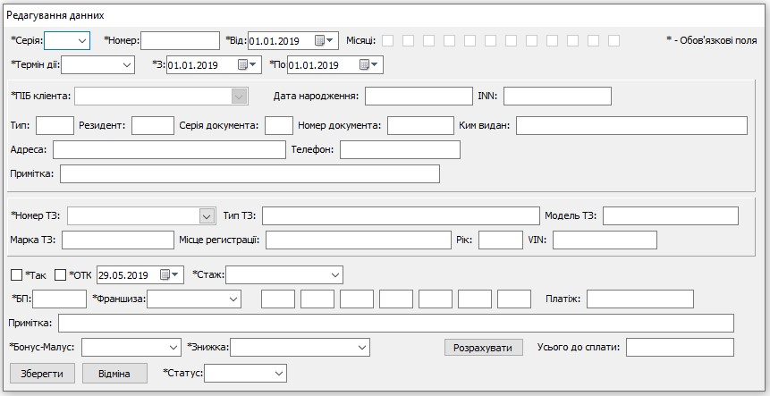

<h1 align="center"> 🖥 Workplace of an insurance company representative 🗃

<u>English(En)</u>
|
<a href="README-ua.md">Українська(Ua)</a>
|
<a href="README-ru.md">Русский(Ru)</a>

</h1>

# 🤔 What is it?

This repository is my first graduation project "Automated workplace of the representative of the insurance company \*Alfa-Garant".

# 🤨 What is this for?

This program "should" help the insurance agent with entering the data of the client, his vehicle and insurance policy into the database of the insurance company. But since it was just a graduation project, no one needed it.

# 📷 Several screenshots

# 📚 Technology

1. The program is written in Embarcadero RAD Studio 10 Seattle Architect 23.0 in **C ++** (not in Pascal, as GitHub shows).
2. The database was written using IBExpert 2009.03.17.3 and FireBird 2.5.2.

# 👀 Important

Database access data:

> `USER:` _SYSDBA_
>
> `PASSWORD:` _masterkey_

# 🎁 Known bugs

- [ ] The "Edit Data" window does not immediately display information. To fix this, once again click on the required policy in the "Policies" window.
- [ ] The same happens if you want to edit the data of a client or his vehicle.

---

_\*The program (except for the name of the company) has nothing to do with the real company._